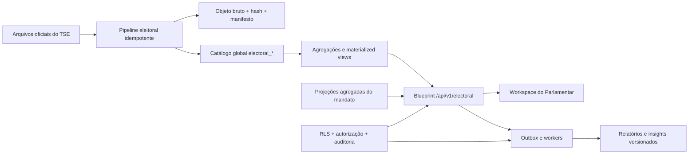

# Estratégia de desenvolvimento — Inteligência Eleitoral

## 1. Objetivo

Implementar no GabFlow o módulo **Inteligência Eleitoral e Territorial** como um
bounded context novo, apoiado em dados oficiais e versionados do TSE, com acesso
integral reservado ao usuário `representative` (Parlamentar), isolamento entre
gabinetes e integração exclusivamente agregada com os dados operacionais do mandato.

Este documento traduz as especificações em uma estratégia compatível com a base
atual do GabFlow. Ele não substitui os requisitos, ADRs, OpenAPI, AsyncAPI ou
cenários Gherkin presentes em `docs/specs-inteligencia-eleitoral`.

## 2. Decisões de direção

1. **Arquitetura atual primeiro.** O módulo será implementado em Flask, SQLAlchemy,
   Alembic, React e no outbox transacional já existente. FastAPI, Celery, Redis e
   Qdrant citados como stack de referência não serão introduzidos apenas para este
   módulo.
2. **Módulo opt-in.** A chave será `inteligencia_eleitoral` e ficará fora do conjunto
   habilitado por padrão. A liberação exigirá entitlement do plano e habilitação do
   gabinete. Nenhum gabinete existente receberá acesso por efeito de migration ou
   fallback de configuração.
3. **Titularidade parlamentar.** Somente `representative` terá direito próprio e
   acesso integral. A delegação prevista em RF-003 será uma concessão temporária de
   capacidades, não uma ampliação permanente do perfil do assessor.
4. **Catálogo global separado.** Eleições, candidaturas, territórios oficiais,
   resultados e versões de dataset serão globais e imutáveis. Favoritos,
   comparações, relatórios, cenários, insights e métricas do mandato serão privados
   do tenant e protegidos por RLS.
5. **Sem colisão com o território operacional.** A tabela atual `territories` é
   tenant-scoped e representa regiões cadastradas pelo gabinete. O catálogo usará
   entidades `electoral_*` e uma tabela explícita de correspondência entre território
   eleitoral e território operacional.
6. **Dados agregados somente.** O módulo não oferecerá navegação de um resultado
   eleitoral para uma pessoa, solicitação ou endereço. Camadas do mandato serão
   projeções agregadas com supressão padrão abaixo de 10 ocorrências.
7. **Contratos antes das telas.** O OpenAPI e o AsyncAPI serão completados e validados
   antes de cada fatia vertical. A versão atual cobre apenas o núcleo e ainda não
   descreve administração de datasets, favoritos, delegações, status/download de
   jobs, qualidade e comparação histórica.

## 3. Leitura da arquitetura existente

### Capacidades que podem ser reaproveitadas

- JWT em cookie, CSRF, papéis e sessão única;
- habilitação de módulos por tenant e bloqueio central por blueprint;
- perfil `representative` e vínculo único de Parlamentar por tenant;
- PostgreSQL 17 com PostGIS e pgvector na imagem de banco;
- contexto transacional de tenant e políticas RLS;
- auditoria com ator, tenant, IP, user-agent e before/after;
- outbox transacional, worker, retries, leases e scheduler;
- armazenamento criptografado e downloads assinados;
- geração de PDF com ReportLab;
- RAG privado/global, validação de saída, citações, feedback e segurança de conteúdo;
- painel territorial, jurisdição em GeoJSON e agregações operacionais com supressão.

### Lacunas que precisam ser tratadas na fundação

- o conjunto `AVAILABLE_MODULES` ainda não possui o novo módulo e hoje o default é
  derivado de todos os módulos disponíveis;
- o RBAC existente verifica papéis, mas não capacidades temporárias;
- não existe uma entidade formal de mandato ativo; os dados estão parcialmente em
  JSON no tenant;
- `territories` não pode representar simultaneamente a taxonomia operacional privada
  e a hierarquia eleitoral global/versionada;
- consultas de leitura normalmente não gravam auditoria, enquanto a especificação
  exige auditoria de consultas, comparações e exportações;
- não há modelo de job consultável pelo frontend para relatórios e insights;
- o frontend não usa roteador nem biblioteca cartográfica; o mapa atual é um SVG
  próprio e deve ser evoluído com cuidado para coropletas e acessibilidade;
- não há suporte XLSX declarado no backend;
- não há cache distribuído. Materialized views e índices devem ser medidos antes de
  adicionar nova infraestrutura.

## 4. Arquitetura proposta



### Organização sugerida

```text
backend/app/electoral/
  routes.py               # endpoints tenant-facing
  permissions.py          # módulo, mandato, papel e delegações
  catalog.py              # consultas ao catálogo global
  analytics.py            # resultados, denominadores e comparações
  geography.py            # hierarquia, geometrias e crosswalk
  ingestion.py            # download, parsing e staging
  quality.py              # validações e publicação
  overlays.py             # projeções agregadas do mandato
  reports.py              # PDF, CSV e XLSX
  insights.py             # integração governada com IA/RAG
  scenarios.py            # simulações isoladas do dado oficial
  serializers.py

frontend/src/components/electoral/
  ElectoralIntelligencePage.jsx
  ElectionSelector.jsx
  CandidateSearch.jsx
  CandidateResults.jsx
  CandidateComparison.jsx
  ElectoralMap.jsx
  DatasetProvenance.jsx
  ReportJobs.jsx
```

O blueprint `electoral` será registrado em `/api/v1`, associado ao módulo
`inteligencia_eleitoral` no bloqueio central e protegido por um decorator específico.

### Regra de autorização

Uma chamada tenant-facing só prossegue quando todas as condições forem verdadeiras:

1. token e sessão válidos;
2. tenant do token ativo e contrato não bloqueado;
3. plano contratado inclui o módulo e o módulo está habilitado para o tenant;
4. mandato ativo associado ao tenant e ao Parlamentar titular;
5. ator é `representative` ou possui delegação válida para a capacidade exata;
6. recurso tenant-scoped pertence ao tenant derivado do token, nunca do payload.

Para o escopo inicial solicitado, a navegação será exibida apenas ao Parlamentar. A
delegação de assessor deve ficar atrás de uma feature flag própria até haver decisão
de produto sobre como o assessor acessará jornadas que são visualmente exclusivas do
Parlamentar. Isso preserva RF-003 sem liberar o módulo genericamente a `staff`.

### Modelo de dados recomendado

#### Catálogo global e versionado

- `electoral_dataset_versions`: origem, URL, hash, parser, cobertura, status, nota e
  manifesto de validação;
- `electoral_elections`: ano, turno, tipo, abrangência e data;
- `electoral_offices`: cargo e esfera;
- `electoral_parties`: identidade eleitoral por período, federação/coligação e
  referência opcional ao catálogo partidário atual do GabFlow;
- `electoral_candidates`: identidade normalizada da pessoa no catálogo público;
- `electoral_candidacies`: candidatura versionada por eleição, cargo, número e
  partido. Essa separação é necessária para comparação histórica segura;
- `electoral_territories`: hierarquia global, código oficial, nível, parent e versão
  geográfica;
- `electoral_territory_geometries`: geometria PostGIS, fonte, validade e indicação de
  mapeamento oficial ou derivado;
- `electoral_results`: versão, candidatura, território, votos e metadados de cálculo;
- materialized views por eleição, cargo, nível e UF para consultas frequentes.

Resultados devem guardar contagens canônicas. Percentual e ranking podem ser
materializados, mas sempre com `denominator_type`, `denominator_value`, fórmula e
versão que permitam reprodução.

#### Domínio privado do gabinete

- `mandates`: tenant, Parlamentar titular, cargo, jurisdição, início, fim e status;
- `electoral_module_settings`: limiar de privacidade, preferências e pesos ativos;
- `electoral_access_delegations`: grantor, grantee, capacidades, motivo, validade e
  revogação;
- `electoral_territory_mappings`: correspondência revisável entre território global e
  `territories`/jurisdição do tenant, com método e confiança;
- `electoral_favorites` e `electoral_saved_comparisons`;
- `electoral_report_jobs` e `electoral_generated_reports`;
- nas fases seguintes: snapshots do mandato, ICT, insights, feedback, compromissos e
  cenários.

Todas as tabelas privadas terão `tenant_id NOT NULL`, constraints compostas quando
cruzarem recursos do tenant, `ENABLE/FORCE ROW LEVEL SECURITY`, grants explícitos às
roles de runtime e testes reais em PostgreSQL.

### Ingestão e publicação

O pipeline terá estados explícitos:

`DISCOVERED -> DOWNLOADED -> HASHED -> PARSED -> VALIDATED -> PUBLISHED`

Falhas terminam em `REJECTED`, preservando arquivo, manifesto e erros. Uma execução
com a mesma origem e hash deve ser idempotente.

Fluxo recomendado:

1. registrar a origem oficial e baixar o artefato para armazenamento global;
2. calcular hash antes de interpretar o conteúdo;
3. carregar tabelas de staging via processamento em lote;
4. normalizar códigos oficiais, candidaturas, partidos e territórios;
5. validar schema, duplicidade, valores negativos, hierarquia, totalizações e
   cobertura declarada;
6. construir índices/agregações fora da transação de atendimento;
7. publicar a versão atomicamente e emitir `electoral.dataset.published`;
8. manter a versão anterior consultável e nunca sobrescrever resultados.

O primeiro dataset não deve tentar cobrir todo o país e todas as granularidades de
uma só vez. O piloto deve carregar duas eleições comparáveis, um cargo e a jurisdição
do tenant piloto; a expansão ocorre por UF/cargo/eleição depois dos benchmarks.

### Geografia e mapas

- usar códigos oficiais como chave de interoperabilidade sempre que existirem;
- distinguir `OFFICIAL`, `DERIVED` e `MANUAL_REVIEWED` em toda geometria/correspondência;
- começar a coropleta pelo menor nível com polígonos confiáveis no dataset piloto;
- zonas, bairros, locais e seções sem polígono confiável aparecem inicialmente em
  tabela/ranking ou como pontos, nunca como limites inventados;
- o mapa e a tabela compartilham o mesmo dataset, filtros, escala e seleção;
- fonte, versão, denominador, legenda, ausência de dados e qualidade ficam visíveis;
- a tabela acessível é parte da jornada principal, não apenas fallback técnico.

## 5. Plano de entrega por incrementos

### Rastreabilidade de alto nível

| Épico dos specs | Incremento principal | Observação |
| --- | --- | --- |
| E01 — Acesso e configuração | 0 e 4 | Acesso titular no 0; UI de delegação somente após decisão de produto |
| E02 — Ingestão e qualidade | 1 | Catálogo, proveniência, validação, publicação e qualidade |
| E03 — Pesquisa e análise | 2 e 3 | Pesquisa/detalhe primeiro; comparação, histórico e favoritos depois |
| E04 — Mapas e painéis | 3 e 5 | Coropleta eleitoral no MVP; overlays do mandato na fase seguinte |
| E05 — Operação do mandato | 5 | Somente projeções agregadas e suprimidas |
| E06 — IA e RAG | 6 | Guardrails MUST são pré-condição de qualquer insight |
| E07 — Cenários e metas | 7 | Mantido fora do MVP para não misturar simulação e dado oficial cedo |
| E08 — Relatórios e exportações | 4 | Jobs, geração, download, revogação e auditoria |
| E09 — Alertas e compromissos | 5 | Depende de snapshots e overlays consolidados |
| RN-001 a RN-053 | Todos | Autorização, fonte, privacidade, IA, simulação e relatório viram testes |
| RNF-001 a RNF-010 | 0 a 4 e gates de rollout | Especialmente P95, WCAG, RLS, logs e revisão legal |

### Incremento 0 — Contratos e fundação de acesso

**Objetivo:** tornar segura a inclusão do bounded context antes de carregar dados.

Entregas:

- registrar `inteligencia_eleitoral` como módulo opt-in, criar o entitlement por plano
  e não alterar tenants atuais;
- adicionar blueprint vazio com bloqueio de módulo e papel;
- formalizar mandato ativo e backfill a partir dos dados atuais do tenant;
- criar decorator de capacidades e modelo de delegação, inicialmente desabilitado na
  interface;
- definir taxonomia de auditoria (`electoral.*`) e minimização de filtros/prompts;
- completar no OpenAPI as respostas 401/403/404/422 e o envelope/paginação padrão;
- definir no AsyncAPI idempotency key, correlation id, versão do evento e semântica de
  retries;
- criar feature flags separadas para catálogo, exportação, overlay, IA e cenários.

Critérios de saída:

- Parlamentar de tenant habilitado recebe `200` no endpoint de disponibilidade;
- qualquer outro papel sem delegação recebe `403` e não vê o menu;
- tenant desabilitado recebe `403 module_disabled`;
- acesso cruzado não revela existência de recursos;
- testes provam que a nova chave não foi habilitada em gabinetes existentes.

### Incremento 1 — Pipeline TSE e catálogo consultável

**Objetivo:** publicar uma primeira carga oficial, reproduzível e validada.

Entregas:

- migrations do catálogo global, staging, índices e geometrias;
- comando operacional para importar por eleição/cargo/UF/jurisdição;
- armazenamento do arquivo bruto, hash, parser e manifesto;
- validações bloqueantes e nota de qualidade;
- publicação atômica e eventos de dataset;
- endpoints de eleições, cargos, cobertura, versões e qualidade;
- runbook de reprocessamento, correção e rollback de publicação.

Critérios de saída:

- duas eleições comparáveis publicadas para o piloto;
- totais reconciliados com o manifesto da fonte;
- repetir a mesma carga não duplica dados;
- uma carga divergente permanece rejeitada;
- versão e origem aparecem em toda resposta analítica.

### Incremento 2 — Primeira fatia vertical de análise

**Objetivo:** permitir que o Parlamentar encontre uma candidatura e examine seu
resultado territorial de ponta a ponta.

Entregas:

- pesquisa tolerante a acentos por nome, número, partido, cargo e eleição;
- distinção de homônimos pela candidatura;
- detalhamento por nível territorial disponível;
- votos absolutos, participação, posição, denominador, fórmula e avisos de qualidade;
- tela inicial do módulo com filtros persistidos na URL;
- tabela ordenável/paginada e estado vazio/sem dados;
- auditoria de consulta com filtros minimizados.

Critérios de saída:

- cenário Gherkin de consulta territorial aprovado;
- respostas usam apenas a versão publicada selecionada;
- P95 abaixo de 2 s com cache/agregações aquecidos no dataset piloto;
- navegação por teclado, leitura de tabela e contraste atendem WCAG 2.2 AA.

### Incremento 3 — Comparação, histórico e mapa

**Objetivo:** completar o núcleo analítico do MVP.

Entregas:

- comparação de 2 a 5 candidaturas com validação de eleição, cargo e denominador;
- histórico da mesma pessoa entre eleições por meio de candidaturas versionadas;
- avisos de alteração de partido, cargo e limites territoriais;
- mapa coroplético sincronizado com a tabela;
- alternância entre votos, percentual, ranking e variação;
- favoritos e comparações salvas, privados por usuário;
- crosswalk revisável entre território eleitoral e território operacional.

Critérios de saída:

- sexto candidato é rejeitado com `422` e mensagem útil;
- todas as séries usam denominador comparável ou exibem incompatibilidade;
- mapa nunca desenha geometrias derivadas como se fossem oficiais;
- favoritos e análises salvas não vazam entre usuários ou tenants.

### Incremento 4 — Exportações e delegação controlada

**Objetivo:** fechar o MVP operacional e auditável.

Entregas:

- jobs assíncronos de PDF, CSV e XLSX via outbox;
- endpoints de status, retry autorizado, download e revogação;
- PDF com marca d'água, autoria, data, filtros, fonte, versão e metodologia;
- downloads assinados, expiração e armazenamento criptografado;
- tela de delegação granular pelo Parlamentar, caso a exceção esteja aprovada;
- auditoria de concessão, revogação, geração, compartilhamento e download;
- limpeza agendada conforme retenção.

Critério de saída do MVP:

- duas eleições validadas;
- jornada pesquisa -> análise -> comparação -> mapa -> exportação aprovada;
- P95 analítico abaixo de 2 s e operação acima de 10 s sempre assíncrona;
- testes de isolamento, autorização, RLS, acessibilidade e Gherkin aprovados;
- revisão jurídica/RIPD concluída antes da ativação em produção.

### Incremento 5 — Inteligência integrada do mandato

- projeções agregadas de demandas, SLA, agenda, ações e entregas;
- limiar padrão de 10 e generalização de categorias sensíveis;
- snapshots reproduzíveis por período e configuração;
- Índice de Cobertura Territorial com fórmula e pesos versionados;
- briefing territorial, alertas e compromissos públicos;
- nenhuma recomendação usa baixa votação para priorizar atendimento público.

### Incremento 6 — IA explicável

- políticas de recusa para inferência individual e atributos sensíveis;
- análise individual/comparativa com fatos, cálculos, hipóteses e limitações;
- citações a dataset, versão, filtros e documentos autorizados;
- execução assíncrona, modelo/template versionados e validação quantitativa;
- feedback, contestação, ocultação e revisão humana;
- dataset adversarial específico para inferência de voto, causalidade inventada e
  ausência de evidência.

O RAG existente deve ser estendido por projeções estruturadas; resultados eleitorais
massivos não devem ser transformados indiscriminadamente em chunks vetoriais.

### Incremento 7 — Cenários e expansão

- cenários imutáveis em relação ao resultado oficial;
- premissas, autor, baseline, fórmulas, intervalos e disclaimer persistidos;
- compartilhamento somente leitura e cópia para edição;
- sensibilidade, metas agregadas e comparação de cenários;
- expansão gradual de eleições, cargos, UFs e granularidades após medição de custo,
  qualidade e latência.

## 6. Estratégia de testes

### Backend unitário e de contrato

- parser, normalização, hashes e idempotência;
- denominadores, ranking, variação, comparabilidade e ICT;
- validação de 2 a 5 candidatos;
- políticas de autorização/delegação e expiração;
- supressão de pequenos grupos e categorias sensíveis;
- serializers sem PII e conformidade com OpenAPI.

### Integração PostgreSQL/PostGIS

- migrations upgrade/downgrade e extensões;
- partições, índices GiST/BTREE e planos das consultas críticas;
- RLS/FORCE RLS com roles reais de API e worker;
- tentativa de acesso cruzado por identificador conhecido;
- hierarquia, interseções e geometrias inválidas;
- publicação atômica e troca de versão.

### Worker e arquivos

- retries, idempotência, lease, falha definitiva e retomada;
- revalidação de tenant e capacidade antes de jobs privados;
- PDF/CSV/XLSX reproduzindo filtros e versão;
- marca d'água, expiração, revogação e retenção.

### Frontend

- menu exclusivo, bloqueio de acesso e estados de feature flag;
- busca, filtros, URL, comparação e limite de candidatos;
- sincronização mapa/tabela e indicação de dados ausentes/derivados;
- provenance panel, jobs e downloads;
- teclado, foco, leitores de tela, contraste e viewport móvel.

### Segurança e IA

- matriz role x módulo x tenant x capacidade x validade;
- prompts adversariais e minimização de logs;
- checagem automática de números e citações;
- isolamento de fontes RAG e resistência a prompt injection;
- carga e benchmark com dataset representativo, não fixtures triviais.

## 7. Observabilidade e operação

Métricas mínimas:

- duração e status de download, parsing, validação e publicação;
- linhas processadas/rejeitadas e divergências por dataset;
- versão publicada e tempo desde a última carga;
- latência P50/P95/P99 por operação e nível territorial;
- uso e hit rate de agregações/cache;
- jobs pendentes, idade da fila, retries e falhas definitivas;
- exportações, insights aceitos/contestados e recusas de segurança;
- tentativas negadas por módulo, papel, delegação ou tenant.

Logs não devem conter CPF, endereço, conteúdo de demanda nem prompt pessoal bruto.
Dashboards e alertas operacionais devem ser adicionados antes do piloto produtivo.

## 8. Riscos e mitigação

| Risco | Impacto | Mitigação |
| --- | --- | --- |
| Liberação automática do módulo ao alterar defaults | Acesso indevido | Default explícito sem `inteligencia_eleitoral`, migration e teste de regressão |
| Volume nacional por seção/candidato | Carga e consulta inviáveis | Piloto recortado, staging em lote, particionamento, agregações e expansão medida |
| Colisão entre territórios globais e privados | Correlações erradas | Tabelas separadas e crosswalk versionado/revisável |
| Geometria inexistente para bairro/zona/seção | Mapa enganoso | Mostrar tabela/ponto e rotular derivação; nunca inventar polígonos |
| Percentuais não comparáveis | Decisão analítica incorreta | Denominador tipado, fórmula visível e validação de compatibilidade |
| Auditoria de toda consulta crescer demais | Custo e lentidão | Evento minimizado, política de retenção, índices e escrita desacoplada quando seguro |
| Delegação contradizer exclusividade do perfil | Escopo ambíguo | Titularidade exclusiva; delegação como capacidade temporária e feature flag separada |
| Overlay reidentificar cidadãos | Risco LGPD | Agregação prévia, limiar 10, categorias sensíveis e ausência de drill-down |
| IA atribuir causalidade ou intenção | Dano reputacional/jurídico | Saída estruturada, recusas, evidência, validação e revisão humana |
| Contrato OpenAPI incompleto | Retrabalho frontend/backend | Evoluir o contrato por incremento antes do código |

## 9. Decisões pendentes antes do Incremento 1

1. Qual tenant, cargo, UF/jurisdição e duas eleições formarão o piloto?
2. “Apenas Parlamentar” admite a delegação temporária MUST de RF-003 ou o requisito
   será formalmente adiado/alterado?
3. O mandato será uma entidade transversal do GabFlow ou inicialmente uma entidade
   privada do bounded context eleitoral com backfill do tenant?
4. Qual granularidade do piloto possui geometria oficial suficiente para a primeira
   coropleta?
5. Qual política de retenção e armazenamento será aplicada aos arquivos brutos do TSE?
6. Quem opera e aprova a publicação de datasets: Administrador Geral, processo de
   deploy ou função operacional dedicada?
7. Quais exportações podem ser compartilhadas e com quais destinatários internos?

Essas decisões não bloqueiam o Incremento 0. Elas bloqueiam a definição fechada do
dataset piloto e, portanto, o início da ingestão produtiva.

## 10. Backlog inicial executável

1. Atualizar ADR/contrato para registrar Flask/outbox como implementação escolhida.
2. Separar `AVAILABLE_MODULES` de `DEFAULT_MODULES` e cadastrar o módulo opt-in.
3. Criar testes de regressão de habilitação para tenants novos e existentes.
4. Criar blueprint, disponibilidade e authorization guard eleitoral.
5. Modelar mandato ativo e executar backfill seguro.
6. Modelar delegações/capacidades e sua auditoria.
7. Completar OpenAPI/AsyncAPI do Incremento 0 e validar os documentos.
8. Criar migrations do catálogo, staging e tabelas tenant-scoped iniciais.
9. Criar políticas/grants RLS e testes PostgreSQL.
10. Implementar importador idempotente e fixtures reduzidas de integração.
11. Implementar validação, nota de qualidade e publicação atômica.
12. Implementar catálogo, busca e resultado territorial.
13. Criar a página do módulo e a primeira jornada acessível.
14. Implementar comparação, histórico e avisos de comparabilidade.
15. Implementar geometria/crosswalk e mapa sincronizado com tabela.
16. Implementar favoritos e comparações salvas.
17. Implementar jobs e exportações PDF/CSV/XLSX.
18. Executar benchmark, revisão de isolamento, WCAG e cenários Gherkin.
19. Realizar revisão jurídica/RIPD e preparar runbook de rollout/rollback.
20. Ativar para um tenant piloto e acompanhar métricas antes da expansão.

## 11. Definition of Done por história

Uma história eleitoral só pode ser encerrada quando tiver, conforme aplicável:

- requisito e cenário Gherkin rastreados;
- contrato OpenAPI/AsyncAPI atualizado;
- autorização e feature flag testadas;
- isolamento lógico e RLS testados;
- auditoria minimizada e retenção definida;
- testes unitários, integração e frontend;
- acessibilidade e estados de erro/ausência de dados;
- métricas, logs e runbook operacional;
- fonte, versão, denominador e metodologia visíveis;
- documentação e revisão de privacidade concluídas.
