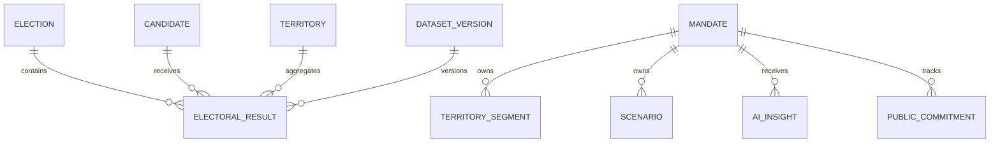

# Modelo de Dados

## Entidades principais

| Entidade | Finalidade | Tenant |
|---|---|---|
| `election` | Eleição, turno, abrangência e data | Global |
| `electoral_office` | Cargo disputado | Global |
| `candidate` | Identidade eleitoral versionada | Global |
| `party` | Partido/federação por período | Global |
| `territory` | Município, zona, bairro, local e seção | Global/versionado |
| `electoral_result` | Totalização por candidato e território | Global/versionado |
| `dataset_version` | Proveniência, hash, qualidade e publicação | Global |
| `analysis_favorite` | Favorito do usuário | Sim |
| `saved_comparison` | Configuração de comparativo | Sim |
| `electoral_report_job` | Finalidade, filtros, formato, estado e retries | Sim |
| `electoral_generated_report` | Objeto cifrado, hash, expiração e downloads | Sim |
| `electoral_identity_review` | Revisão privada do vínculo entre candidaturas | Sim |
| `electoral_geometry_version` | Fonte, hash e referência da malha oficial | Global/versionado |
| `electoral_geometry_feature` | Polígono oficial PostGIS e GeoJSON | Global/versionado |
| `electoral_territory_crosswalk` | Vínculo revisável TSE–IBGE | Global/versionado |
| `territory_segment` | Grupo manual de territórios | Sim |
| `mandate_metric_snapshot` | Indicador agregado do mandato | Sim |
| `territorial_coverage_index` | Resultado e pesos do ICT | Sim |
| `scenario` | Simulação e premissas | Sim |
| `ai_insight` | Insight, evidências e feedback | Sim |
| `public_commitment` | Compromisso e evidências | Sim |
| `generated_report` | Relatório, filtros e expiração | Sim |
| `access_delegation` | Delegação granular | Sim |
| `audit_event` | Trilha de ações | Sim |

## Relacionamentos

## Campos mínimos

### `electoral_result`

- `id`
- `dataset_version_id`
- `election_id`
- `candidate_id`
- `territory_id`
- `votes`
- `valid_votes_denominator`
- `vote_share`
- `rank`
- `calculation_metadata`

Chave única lógica: versão + eleição + candidato + território.

### `ai_insight`

- `id`, `tenant_id`, `mandate_id`
- `analysis_type`
- `input_snapshot`
- `facts`
- `calculations`
- `hypotheses`
- `limitations`
- `citations`
- `model_provider`, `model_name`, `prompt_version`
- `status`, `created_by`, `created_at`
- `feedback`, `reviewed_by`, `reviewed_at`

### `access_delegation`

- `id`, `tenant_id`, `grantor_user_id`, `grantee_user_id`
- `capabilities`
- `reason`
- `valid_from`, `valid_until`
- `revoked_at`, `revoked_by`

### `public_commitment`

- `id`, `tenant_id`, `mandate_id`, `territory_id`
- `title`, `description`, `responsible_user_id`, `due_on`
- `status`, `progress`, `completed_at`
- `public_location_name`, `latitude`, `longitude`, `location_is_public`
- `created_by_id`, `updated_by_id`, `created_at`, `updated_at`

Estados manuais: `PLANNED`, `IN_PROGRESS`, `COMPLETED` e `CANCELLED`. O estado
`OVERDUE` é derivado do prazo e identificado como tal no contrato, sem sobrescrever o
estado manual.

Evidências ficam em `electoral_commitment_evidence`; cada criação, atualização ou nova
evidência acrescenta um registro append-only em `electoral_commitment_history`.

## Estratégia geoespacial

- PostgreSQL/PostGIS.
- Geometrias em `MULTIPOLYGON` para territórios e `POINT` para locais públicos de votação.
- Índice GiST.
- Tabelas eleitorais particionadas por eleição e, quando necessário, UF.
- Materialized views para agregações recorrentes.

## Retenção

| Dado | Política inicial |
|---|---|
| Dataset eleitoral oficial | Permanente/versionado |
| Auditoria de exportação e acesso | 5 anos, configurável |
| Relatório gerado | 90 dias, renovável |
| Insight de IA | Enquanto necessário ao mandato ou até exclusão válida |
| Prompt bloqueado | 90 dias com minimização |
| Cenário | Até exclusão pelo titular, mantendo auditoria mínima |

## Isolamento

- Row-Level Security para tabelas de tenant.
- `tenant_id` derivado do token/sessão.
- Chaves estrangeiras compostas quando houver risco de vínculo entre tenants.
- Jobs assíncronos recebem tenant assinado e revalidam autorização.
