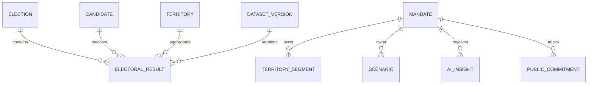

# Modelo de Dados

## Entidades principais

| Entidade | Finalidade | Tenant |
|---|---|---|
| `election` | Eleição, turno, abrangência e data | Global |
| `electoral_office` | Cargo disputado | Global |
| `candidate` | Identidade eleitoral versionada | Global |
| `party` | Partido/federação por período | Global |
| `territory` | Município, zona, bairro, local e seção | Global/versionado |
| `electoral_result` | Totalização por candidato e território | Global/versionado |
| `dataset_version` | Proveniência, hash, qualidade e publicação | Global |
| `electoral_territorial_dataset_version` | Extensão versionada das fontes de seção e local | Global |
| `electoral_territorial_unit` | Seção, local, bairro derivado, endereço e coordenadas | Global/versionado |
| `electoral_section_result` | Votos nominais oficiais por candidatura e seção | Global/versionado |
| `analysis_favorite` | Favorito do usuário | Sim |
| `saved_comparison` | Configuração de comparativo | Sim |
| `electoral_report_job` | Finalidade, filtros, formato, estado e retries | Sim |
| `electoral_generated_report` | Objeto cifrado, hash, expiração e downloads | Sim |
| `electoral_identity_review` | Revisão privada do vínculo entre candidaturas | Sim |
| `electoral_geometry_version` | Fonte, hash e referência da malha oficial | Global/versionado |
| `electoral_geometry_feature` | Polígono oficial PostGIS e GeoJSON | Global/versionado |
| `electoral_territory_crosswalk` | Vínculo revisável TSE–IBGE | Global/versionado |
| `territory_segment` | Grupo manual de territórios | Sim |
| `mandate_metric_snapshot` | Indicador agregado do mandato | Sim |
| `territorial_coverage_index` | Resultado e pesos do ICT | Sim |
| `scenario` | Simulação e premissas | Sim |
| `ai_insight` | Insight, evidências e feedback | Sim |
| `public_commitment` | Compromisso e evidências | Sim |
| `generated_report` | Relatório, filtros e expiração | Sim |
| `access_delegation` | Delegação granular | Sim |
| `audit_event` | Trilha de ações | Sim |

## Relacionamentos

## Campos mínimos

### `electoral_result`

- `id`
- `dataset_version_id`
- `election_id`
- `candidate_id`
- `territory_id`
- `votes`
- `valid_votes_denominator`
- `vote_share`
- `rank`
- `calculation_metadata`

Chave única lógica: versão + eleição + candidato + território.

### `ai_insight`

- `id`, `tenant_id`, `mandate_id`
- `analysis_type`
- `input_snapshot`
- `facts`
- `calculations`
- `hypotheses`
- `limitations`
- `citations`
- `model_provider`, `model_name`, `prompt_version`
- `status`, `created_by`, `created_at`
- `feedback`, `reviewed_by`, `reviewed_at`

Na primeira entrega, `electoral_insights` é um job assíncrono e separa fisicamente os
blocos `facts`, `calculations`, `hypotheses`, `limitations` e `citations`. O snapshot de
entrada registra dataset, hash e filtros; o conteúdo é sempre rascunho para revisão.
Feedback é append-only em `electoral_insight_feedback` e registra a versão do modelo.
Avaliações `DISCARDED` e `CONTESTED` ocultam o insight até revisão.

A Release 8.1 acrescenta `safety_classification`, `output_validation`, `review_status`,
`reviewed_by_id`, `reviewed_at`, `review_notes` e `review_revision`. Perguntas permitidas
são mantidas no payload para reprodução do job; perguntas bloqueadas armazenam somente
hash, tamanho, categoria, sinais e versões das políticas. A fila humana aceita `APPROVE`,
`REJECT` e `RESTORE`, preservando o hash dos fatos que foram revisados.

### `electoral_scenario`

- `id`, `tenant_id`, `mandate_id`, `created_by_id`
- `baseline_election_id`, `candidate_id`, `level`
- `assumptions`
- `baseline_snapshot`, `result`
- `methodology_version`, `disclaimer`, `created_at`

O baseline é uma cópia versionada do resultado oficial usado no cálculo. A simulação
aceita deltas limitados de participação da candidatura e denominador por território;
nunca atualiza `electoral_results` e sempre se identifica como hipótese, não pesquisa ou
previsão eleitoral.

A Release 8.2 acrescenta incertezas explícitas de participação e denominador. As faixas
resultantes são determinísticas, possuem `confidence_level = null` e não representam
intervalos de confiança. Cópias geram um novo `electoral_scenario` com
`source_scenario_id`, preservando o snapshot original.

### `electoral_scenario_share`

- `id`, `tenant_id`, `scenario_id`, `created_by_id`
- `token_hash`, `expires_at`, `revoked_at`
- `access_count`, `last_accessed_at`, `created_at`

O token bruto é entregue uma única vez e nunca persistido. O link exige sessão autorizada
no mesmo tenant, é somente leitura, expira em até 30 dias e pode ser revogado.

### `electoral_scenario_analysis`

- `id`, `tenant_id`, `mandate_id`, `created_by_id`
- `analysis_type` (`COMPARISON` ou `SENSITIVITY`)
- `anchor_scenario_id`, `scenario_ids`, `parameters`, `result`
- `methodology_version`, `created_at`

Comparações somente aceitam cenários com eleição, candidatura, nível, recorte, versão e
hash de fonte idênticos. Sensibilidade persiste a grade e seus limites como artefato
auditável, sem atribuir probabilidades.

### `electoral_scenario_portfolio`

- `id`, `tenant_id`, `mandate_id`, `created_by_id`
- `name`, `description`, `status`
- `reference_scenario_id`, `goals`
- `created_at`, `updated_at`

Um portfólio agrupa até 20 cenários estritamente compatíveis. A referência é apenas um
eixo comparativo e nunca significa cenário provável, recomendado ou oficial. `goals`
armazena metas versionadas por evento para votos ou participação, no total agregado ou em
território existente no snapshot.

Associações ficam em `electoral_scenario_portfolio_items`. Remoções são lógicas por
`removed_at`/`removed_by_id`, permitindo reconstituição. Toda criação, alteração, meta,
referência, associação, remoção e exportação acrescenta um registro append-only em
`electoral_scenario_portfolio_events`.

### `access_delegation`

- `id`, `tenant_id`, `grantor_user_id`, `grantee_user_id`
- `capabilities`
- `reason`
- `valid_from`, `valid_until`
- `revoked_at`, `revoked_by`

### `public_commitment`

- `id`, `tenant_id`, `mandate_id`, `territory_id`
- `title`, `description`, `responsible_user_id`, `due_on`
- `status`, `progress`, `completed_at`
- `public_location_name`, `latitude`, `longitude`, `location_is_public`
- `created_by_id`, `updated_by_id`, `created_at`, `updated_at`

Estados manuais: `PLANNED`, `IN_PROGRESS`, `COMPLETED` e `CANCELLED`. O estado
`OVERDUE` é derivado do prazo e identificado como tal no contrato, sem sobrescrever o
estado manual.

Evidências ficam em `electoral_commitment_evidence`; cada criação, atualização ou nova
evidência acrescenta um registro append-only em `electoral_commitment_history`.

### `electoral_alert_preference`

- `id`, `tenant_id`, `mandate_id`, `user_id`
- `enabled`, `channels`, `frequency`, `alert_types`
- `created_at`, `updated_at`

A preferência é individual, única por usuário e mandato e protegida por RLS usando
simultaneamente `app.tenant_id` e `app.user_id`. Os canais iniciais são `IN_APP` e `EMAIL`;
as frequências são imediata, diária ou semanal. O feed sempre referencia um snapshot
reproduzível e não usa votação como gatilho.

### `electoral_user_preference`

- `id`, `tenant_id`, `mandate_id`, `user_id`
- `election_id`, `office_id`, `territory_level`, `indicators`
- `created_at`, `updated_at`

Preferência analítica individual, isolada simultaneamente por tenant e usuário.

### `electoral_territory_segment`

- `id`, `tenant_id`, `mandate_id`, `user_id`, `election_id`
- `name`, `description`, `territory_ids`
- `created_at`, `updated_at`

O segmento contém somente identificadores de unidades territoriais agregadas presentes
nos datasets da eleição e não admite pontos ou endereços de cidadãos.

### `electoral_report_schedule`

- `id`, `tenant_id`, `mandate_id`, `created_by_id`
- `template_report_job_id`, `name`, `frequency`, `recipient_ids`
- `active`, `next_run_at`, `last_run_at`, `created_at`

O worker clona o relatório-base para cada destinatário interno ativo, registra um evento
no outbox e calcula a próxima execução. A desativação é imediata e auditada.

### Camadas derivadas sem persistência individual

Briefing pré-visita, heatmap, clusters e rota de agenda são projeções derivadas de snapshots
territoriais não suprimidos, agenda institucional e locais públicos confirmados. Coordenadas
residenciais e eventos vinculados a cidadão são excluídos na origem.

## Estratégia geoespacial

- PostgreSQL/PostGIS.
- Geometrias em `MULTIPOLYGON` para territórios e `POINT` para locais públicos de votação.
- Índice GiST.
- Tabelas eleitorais particionadas por eleição e, quando necessário, UF.
- Materialized views para agregações recorrentes.

## Retenção

| Dado | Política inicial |
|---|---|
| Dataset eleitoral oficial | Permanente/versionado |
| Auditoria de exportação e acesso | 5 anos, configurável |
| Relatório gerado | 90 dias, renovável |
| Insight de IA | Enquanto necessário ao mandato ou até exclusão válida |
| Prompt bloqueado | 90 dias com minimização |
| Cenário | Até exclusão pelo titular, mantendo auditoria mínima |

## Isolamento

- Row-Level Security para tabelas de tenant.
- `tenant_id` derivado do token/sessão.
- Chaves estrangeiras compostas quando houver risco de vínculo entre tenants.
- Jobs assíncronos recebem tenant assinado e revalidam autorização.
## Identidade eleitoral verificada — Release 8.9

### `electoral_user_candidacy`

- `id`, `tenant_id`, `user_id`
- `candidacy_id`
- `method` (`official_cpf` ou `manual_fallback`)
- `confirmed_at`

A chave lógica é `tenant_id + user_id + candidacy_id`. O `user_id` corresponde ao
parlamentar titular do mandato, inclusive quando um assessor delegado consulta o
módulo. A tabela é privada, protegida por RLS e não é preenchida por heurística.

### `electoral_candidate_registry_sync`

- `id`, `election_year`, `uf`
- `source_url`, `source_hash`
- `fingerprint_key_version`
- `row_count`, `matched_candidacies`, `invalid_rows`
- `manifest`, `synchronized_at`

### `electoral_candidacy_official_identity`

- `id`, `candidacy_id`, `registry_sync_id`
- `cpf_fingerprint` (HMAC-SHA256; nunca CPF reversível)
- `fingerprint_key_version`, `synchronized_at`

O cadastro oficial é associado à candidatura por `SQ_CANDIDATO`, cargo, número e
ciclo eleitoral. Rotação da chave exige nova sincronização com versão incrementada.
