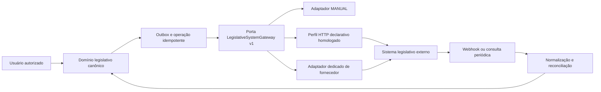

# ADR-013 — Porta canônica e adaptadores para sistemas legislativos

## Status

Aceito para evolução incremental. O modo manual está implementado; conectores externos
permanecem pendentes e serão habilitados por tenant.

## Contexto

Cada Câmara ou gabinete pode usar um sistema de processo legislativo diferente. Alguns
fornecem API REST, outros exportam arquivos, alguns oferecem webhook e muitos não possuem
integração suportada. Tipos documentais, autenticação, estados, identificadores e regras
de protocolo também variam.

Acoplar o domínio do GabFlow a um fornecedor tornaria protocolo, tramitação e retificação
dependentes de contratos externos instáveis. Por outro lado, um conector HTTP totalmente
livre configurado pelo usuário permitiria chamadas arbitrárias, mapeamentos inseguros e
segredos expostos.

## Decisão

Adotar arquitetura de portas e adaptadores. O domínio legislativo opera somente com o
modelo canônico do GabFlow; cada integração implementa uma porta versionada e declara as
capacidades que realmente suporta.

Não haverá obrigação de integração externa. Todo tenant começa com o adaptador `MANUAL`,
que mantém exportação, registro explícito de protocolo e tramitação append-only já
existentes. A ausência de API no sistema oficial não bloqueia a feature.

### Porta canônica

Um adaptador pode implementar as seguintes operações, sempre de forma idempotente:

- `capabilities`: informa recursos, versão e limites;
- `validate_configuration`: valida configuração não secreta sem persistir credenciais;
- `test_connection`: verifica conectividade e autorização sem produzir protocolo;
- `submit_document`: envia documento aprovado após comando humano explícito;
- `get_process`: consulta protocolo e estado externo por referência;
- `list_movements`: importa andamentos usando cursor;
- `handle_webhook`: valida e normaliza uma notificação recebida;
- `health`: expõe saúde, última sincronização e erro sanitizado.

Capacidades canônicas:

- `DOCUMENT_EXPORT`;
- `PROTOCOL_SUBMISSION`;
- `PROTOCOL_LOOKUP`;
- `MOVEMENT_PULL`;
- `MOVEMENT_WEBHOOK`;
- `ATTACHMENT_UPLOAD`;
- `RECTIFICATION_SUBMISSION`.

A interface não pressupõe que todas existam. O frontend habilita somente ações declaradas
pelo conector ativo; qualquer outra ação permanece manual.

### Tipos de adaptador

1. **`MANUAL`:** padrão obrigatório, sem rede ou credencial. Exporta o artefato e recebe
   protocolo/andamentos informados por usuário autorizado.
2. **`DECLARATIVE_HTTP`:** perfil homologado e versionado para APIs convencionais. Permite
   apenas host previamente autorizado, métodos, rotas, campos e transformações de uma
   allowlist. Não executa scripts, expressões arbitrárias ou URLs fornecidas em runtime.
3. **`DEDICATED`:** código versionado para fornecedor cujo contrato exige assinatura,
   paginação, formatos ou fluxo próprio.

Um gabinete configura uma instância de adaptador; ele não cadastra código. Perfis podem
ser reutilizados por vários tenants sem compartilhar credenciais ou estado de sincronização.

### Modelo canônico e mapeamentos

O GabFlow mantém seus tipos e estados internos. O conector conserva mapeamentos explícitos:

- tipo documental canônico para código externo;
- estado externo para estado canônico;
- campos obrigatórios e opcionais por operação;
- formato de documento aceito;
- timezone e semântica das datas;
- referência externa, ID do processo e ID de cada evento.

Valores externos desconhecidos não alteram a projeção vigente. Eles ficam em quarentena
como `NAO_MAPEADO` para decisão humana e atualização versionada do perfil.

### Fluxo de saída

1. Usuário autorizado aprova a minuta e solicita explicitamente o protocolo externo.
2. A mesma transação cria uma operação com chave idempotente e evento no outbox.
3. O worker carrega a minuta no contexto do tenant, valida a capability e produz o payload
   mínimo a partir de uma versão imutável.
4. O adaptador envia a operação com timeout e chave idempotente quando o provedor aceitar.
5. A resposta é normalizada; protocolo e primeiro andamento são persistidos na mesma
   transação de conclusão da operação.
6. Resposta ambígua nunca provoca reenvio automático cego: a operação vai para
   `RECONCILIACAO_NECESSARIA` e consulta o sistema externo antes de nova tentativa.

### Fluxo de entrada

- webhook exige autenticação/assinatura específica do adaptador, tolerância temporal e
  proteção contra replay;
- polling usa cursor próprio por integração e janela de sobreposição para reconciliação;
- deduplicação usa `integration_id + external_event_id` ou hash canônico quando o sistema
  não fornece identificador;
- evento externo nunca atualiza nem exclui andamento existente: cria evento append-only;
- correção externa cria retificação vinculada, quando inequívoca, ou revisão pendente;
- o payload bruto possui retenção curta e acesso operacional restrito; o domínio conserva
  somente campos normalizados e evidências necessárias.

### Segredos e segurança de rede

- a configuração persiste apenas `secret_reference`; token, senha, certificado e chave
  privada nunca entram no banco, API, logs ou auditoria;
- em produção, a referência aponta para AWS Secrets Manager e é resolvida somente no
  processo do adaptador em runtime;
- acesso ao segredo é restrito por tenant/conector e auditado, com rotação independente;
- destinos exigem HTTPS e allowlist administrativa de host/porta; IPs privados, metadata
  endpoints, redirecionamentos não autorizados e DNS rebinding são bloqueados;
- logs registram operação, duração, status e hashes, nunca cabeçalhos de autorização ou
  conteúdo integral do documento;
- conectores possuem timeout, limite de payload, rate limit, circuit breaker e fila/DLQ.

### Consistência e autoridade

O sistema legislativo oficial é autoridade para o número do protocolo e fatos externos;
o GabFlow é autoridade para minuta, versões, aprovação, auditoria e cadeia interna de
retificações. Divergências não são resolvidas por sobrescrita. A reconciliação apresenta
os dois valores e exige regra determinística ou decisão humana auditada.

## Consequências

### Positivas

- nenhum fornecedor contamina o modelo de domínio;
- gabinetes sem API continuam operando pelo modo manual;
- novos conectores reutilizam idempotência, segurança, auditoria e reconciliação;
- capacidades parciais podem ser habilitadas sem simular suporte inexistente;
- falha externa não compromete a edição e aprovação de minutas.

### Custos e limitações

- cada contrato externo ainda precisa de perfil homologado ou adaptador dedicado;
- testes de contrato e sandbox são necessários por versão de conector;
- mapeamentos de status exigem governança e tratamento de valores desconhecidos;
- integração automática só pode ser ativada depois de piloto e aceite do gabinete.

## Estratégia incremental

1. Preservar `MANUAL` como padrão e introduzir as entidades de configuração/operação.
2. Implementar porta, registry, capability negotiation, outbox e tela de diagnóstico.
3. Criar um conector piloto a partir de contrato real, com testes gravados sem segredos.
4. Extrair o primeiro perfil `DECLARATIVE_HTTP` somente quando dois contratos demonstrarem
   abstrações equivalentes.
5. Adicionar polling/webhook e reconciliação apenas às capabilities comprovadas.

Não se deve criar um construtor genérico de requisições HTTP antes dessas evidências.

