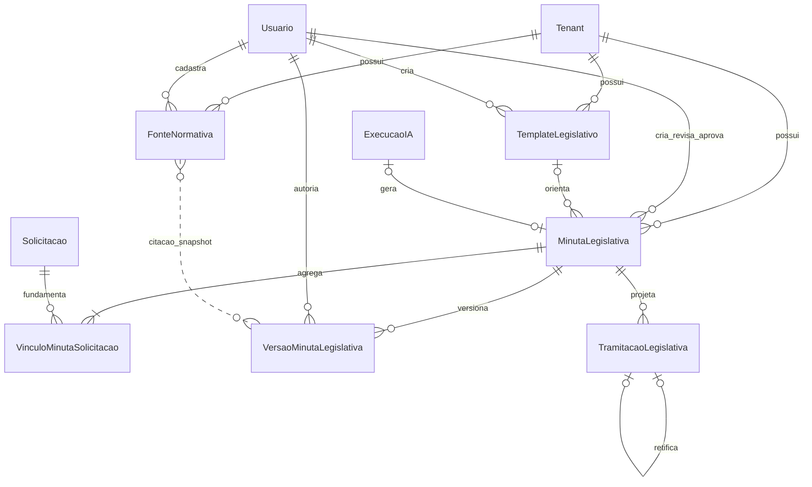

# Modelo de Dados Conceitual

## Tenant
- id
- nome
- tipo
- timezone
- configurações
- status
- chief_of_staff_id

## Usuario
- id
- tenant_id
- nome
- email
- perfil
- funcoes_designadas
- status
- mfa_enabled

## Cidadao
- id
- tenant_id
- nome
- nome_social
- photo_storage_key
- profissao
- data_nascimento
- cpf_cifrado
- cpf_lookup_hash
- cpf_final
- titulo_eleitor
- contatos
- enderecos
- canal_preferencial
- base_legal
- consentimento_contato
- consentimento_divulgacao
- vip
- flags_privacidade
- criado_por_id
- criado_em
- atualizado_em

`cpf_lookup_hash`, quando presente, é um HMAC versionado calculado sobre os onze dígitos
normalizados e possui índice único parcial por `tenant_id`; `cpf_cifrado` preserva o valor
recuperável sob criptografia autenticada e `cpf_final` permite diferenciação visual sem
expor o documento. O CPF completo e o título de eleitor não entram em logs, eventos ou
respostas de listagem; o contrato de detalhe pode retornar apenas o valor necessário a
usuários autorizados. `photo_storage_key` referencia o objeto WebP privado já sanitizado,
armazenado com criptografia autenticada; metadados operacionais do processamento ficam
no evento de auditoria, sem expor o conteúdo.

## VinculoCidadaoOrganizacao
- id
- tenant_id
- cidadao_id
- organizacao_id
- papel
- principal
- criado_por_id
- criado_em

O vínculo representa a responsabilidade ou atuação do cidadão na organização. A chave
`tenant_id`, `cidadao_id`, `organizacao_id` e `papel` é única e todas as referências
privadas incluem o tenant.

## EnderecoCidadao (estrutura JSON do cadastro neste corte)
- id
- tenant_id
- cidadao_id
- endereco_formatado
- logradouro
- numero
- complemento
- cep
- bairro_texto
- latitude
- longitude
- place_id
- territorio_id
- resolucao_status
- resolvido_em

`bairro_texto` e `territorio_id` são resultados somente para consulta. Neste corte, os
componentes do Google Places são validados contra os limites da jurisdição e o território
ativo é associado prioritariamente por ponto-em-polígono e, na ausência de interseção,
por nome ou alias normalizado. A estrutura é persistida no primeiro item de
`citizens.addresses`, permitindo
migração aditiva para tabela própria quando houver múltiplos endereços e versionamento.

## Territorio
- id
- tenant_id
- nome
- aliases
- geometry (`Polygon` ou `MultiPolygon` GeoJSON)
- ativo

Nomes e aliases não podem colidir dentro do tenant. Geometrias são validadas na escrita;
quando mais de um polígono contém o ponto, prevalece a menor área para representar o
recorte mais específico. A implementação JSON é adequada ao volume operacional atual;
índice espacial/PostGIS deve ser adotado se o catálogo crescer para milhares de polígonos.

## HistoricoCidadao
- id
- tenant_id
- cidadao_id
- usuario_id
- acao
- campos_alterados
- metadados_resumidos
- alterado_em

O histórico funcional é append-only, tenant-scoped e registra metadados e nomes de campos alterados. Valores pessoais
permanecem no mecanismo de auditoria protegido somente quando estritamente necessários,
com acesso restrito e retenção definida; logs técnicos recebem apenas identificadores.

## Organizacao
- id
- tenant_id
- tipo
- nome
- contatos
- território

## Solicitacao
- id
- tenant_id
- protocolo
- cidadao_id
- organizacao_id
- origem
- título
- descrição
- categoria_id
- subcategoria_id
- prioridade
- impacto
- urgência
- status
- responsável_id
- latitude
- longitude
- bairro_id
- data_abertura
- prazo
- data_encerramento
- motivo_encerramento

## Interacao
- id
- solicitacao_id
- tipo
- canal
- direção
- conteúdo
- autor
- data
- visibility

## Anexo
- id
- tenant_id
- entidade_tipo
- entidade_id
- arquivo
- mime_type
- hash
- classificação
- dados_extraídos

## Encaminhamento
- id
- solicitacao_id
- destino
- responsável
- status
- prazo
- resposta

## Tarefa
- id
- tenant_id
- entidade
- responsável
- status
- prioridade
- prazo

## AgendaEvent
- id
- tenant_id
- tipo
- status
- titulo
- descricao
- local
- starts_at
- ends_at
- presenca_parlamentar
- participantes
- cidadao_id
- organizacao_id
- territorio_id
- solicitacao_id
- ata
- fotos
- pendencias

`participantes` contém referências a usuários ativos do mesmo tenant e não admite o
Parlamentar. Eventos do tipo `FISCALIZACAO` podem originar uma única ação de fiscalização
depois do horário efetivo de término. A presença parlamentar é um marcador institucional
e visual, sem efeito automático sobre prioridade ou autorização.

## OversightAction
- id
- tenant_id
- agenda_event_id
- titulo
- descricao
- local
- occurred_at
- status
- agency_id
- solicitacao_id
- achados
- fotos_legadas
- responsaveis
- providencias_acompanhamento
- relatorio

`agenda_event_id` é opcional para permitir o registro direto em campo e único quando
preenchido, evitando relatórios duplicados para o mesmo compromisso. A conclusão da ação
sincroniza o evento de agenda vinculado e encerra as notificações dos participantes.

## OversightEvidence
- id
- tenant_id
- oversight_action_id
- tipo
- original_name
- mime_type
- size_bytes
- storage_key
- sha256
- observation
- scan_status
- metadados_da_varredura
- versao_e_algoritmo_de_criptografia
- criado_por_id
- criado_em
- atualizado_em

O conteúdo binário permanece no armazenamento privado; a tabela conserva somente
metadados, integridade e chave opaca. As relações incluem `tenant_id`, a leitura exige
autorização e o upload passa pelas políticas de validação, antimalware e criptografia.

## Domínio de produção legislativa

O agregado central é `MinutaLegislativa` (`legislative_drafts` na implementação), e não
uma `Proposicao` genérica. A minuta começa antes da existência de protocolo, conserva o
estado de geração assistida, passa por revisão e aprovação humana e somente então pode
originar a cadeia de tramitação. O contrato HTTP usa os nomes em português; entre
parênteses são indicadas as tabelas físicas atuais.

### MinutaLegislativa (`legislative_drafts`)

- `id`
- `tenant_id`
- `document_type`: `INDICACAO`, `REQUERIMENTO`, `OFICIO`, `MOCAO`,
  `PEDIDO_INFORMACAO` ou `PROJETO_LEI`
- `status`: `RASCUNHO`, `EM_REVISAO`, `APROVADA` ou `REJEITADA`
- `generation_status`: `PENDENTE`, `PROCESSANDO`, `CONCLUIDA` ou `FALHOU`
- `title`
- `content`
- `justification`
- `legal_basis`: snapshots JSON das citações normativas confirmadas
- `sources`: fontes usadas na geração
- `unsupported_passages`: trechos ainda sem fundamentação
- `similar_proposals`: precedentes recuperados
- `generation_metadata`: parâmetros, ordem das solicitações e evidências da geração
- `template_id` opcional
- `ai_execution_id` opcional e único
- `current_version`: projeção do maior número de versão persistido
- `protocol_number` opcional e único por tenant
- `protocolled_at` opcional
- `current_tramitation_status` opcional: projeção do último evento vigente
- `created_by_id`, `reviewed_by_id`, `approved_by_id`
- `reviewed_at`, `approved_at`
- `error`
- `created_at`, `updated_at`

`content`, `justification` e `legal_basis` representam o estado editável corrente. Eles
não substituem o histórico: toda alteração aceita de conteúdo cria um snapshot em
`VersaoMinutaLegislativa`. `current_version`, protocolo e status de tramitação são campos
de leitura rápida e devem ser reconstruíveis a partir das versões e dos eventos.

### VinculoMinutaSolicitacao (`legislative_draft_requests`)

- `id`
- `tenant_id`
- `draft_id`
- `request_id`
- `created_at`

Existe unicidade por `draft_id + request_id`. A regra de negócio exige entre uma e vinte
solicitações do mesmo tenant. A solicitação principal e a ordem são atualmente
preservadas em `MinutaLegislativa.generation_metadata.solicitacoesIds`; o primeiro ID é a
principal. Essa decisão mantém compatibilidade com a implementação, mas não constitui
integridade relacional forte. A evolução recomendada é adicionar `position` e
`is_primary` ao vínculo, com uma única principal por minuta e índice único de posição.

### VersaoMinutaLegislativa (`legislative_draft_versions`)

- `id`
- `tenant_id`
- `draft_id`
- `version_number`
- `title`
- `content`
- `justification`
- `legal_basis`
- `unsupported_passages`
- `change_reason`
- `created_by_id`
- `created_at`

A chave `draft_id + version_number` é única e a numeração é crescente. Cada registro é
um snapshot completo do conteúdo legislativo editável, suficiente para consulta,
comparação e restauração desses campos. Restaurar uma versão nunca sobrescreve snapshots:
copia seu conteúdo para o estado corrente e cria outra versão com novo número e motivo
obrigatório. A imutabilidade é hoje garantida pela
camada de serviço e pela auditoria; o banco ainda não possui trigger que negue `UPDATE`
ou `DELETE`, e a FK usa `ON DELETE CASCADE` quando a minuta é removida. Portanto,
retenção física/WORM continua sendo uma decisão arquitetural pendente caso haja exigência
legal de não apagamento no banco.

### TemplateLegislativo (`legislative_templates`)

- `id`
- `tenant_id`
- `document_type`
- `name`, único por tenant
- `structure`
- `active`
- `created_by_id`
- `created_at`, `updated_at`

Templates são desativados, não excluídos no fluxo funcional. Somente templates ativos e
compatíveis com o tipo podem iniciar novas minutas. `MinutaLegislativa.template_id` é
opcional e usa `ON DELETE SET NULL`; o conteúdo já gerado permanece nas versões, mas a
proveniência do template deixa de ser relacional se houver exclusão física. A política
arquitetural é impedir essa exclusão pelo serviço e preservar o registro inativo.

### FonteNormativa (`normative_sources`)

- `id`
- `tenant_id`
- `source_type`
- `title`, `reference`, `excerpt`
- `jurisdiction`, `source_url`
- `version`
- `checksum`
- `valid_from`, `valid_until`
- `rag_collection`, atualmente `legislacao`
- `active`
- `created_by_id`
- `created_at`, `updated_at`

A chave conceitual `tenant_id + title + reference + version` é única. Minutas e versões
persistem a citação como snapshot JSON contendo, quando disponível, `sourceId`,
`versaoFonte`, `checksum`, referência, trecho e URL. Não há tabela de junção entre versão
e fonte: o snapshot conserva a evidência citada mesmo após desativação ou edição da fonte.
O endpoint atual permite atualizar a mesma linha, inclusive seu conteúdo, versão e
checksum; portanto `sourceId` sozinho não identifica historicamente o texto recuperado.
Para versionamento relacional forte, uma mudança material deve criar nova linha (ou uma
tabela `normative_source_versions`) e tornar versões publicadas imutáveis. Até essa
evolução, a prova histórica é o snapshot com checksum armazenado na versão da minuta.

Cada alteração também gera uma projeção governada `NORMATIVE_SOURCE` em
`rag_knowledge_sources`. O projetor cria versões imutáveis em `rag_document_versions` e
chunks em `rag_chunks`, propagando ativação e vigência. Essa projeção serve à descoberta
semântica; a linha em `normative_sources` continua sendo reconsultada antes da sugestão e
da aplicação, portanto o índice não decide validade jurídica.

### TramitacaoLegislativa (`legislative_tramitations`)

- `id`
- `tenant_id`
- `draft_id`
- `status`: `PROTOCOLADA`, `DISTRIBUIDA`, `EM_COMISSAO`, `EM_PAUTA`, `APROVADA`,
  `REJEITADA`, `SANCIONADA`, `VETADA`, `ARQUIVADA` ou `RETIRADA`
- `stage`
- `destination`
- `external_reference`
- `notes`
- `occurred_at`: instante do fato no processo legislativo
- `created_at`: instante do registro no GabFlow
- `created_by_id`
- `rectifies_id` opcional
- `rectification_reason` obrigatório para retificações

O protocolo manual cria o primeiro evento `PROTOCOLADA`; não existe protocolo
automático. Eventos são append-only e respeitam a ordem de `occurred_at`. Uma retificação
cria novo evento que aponta para o registro corrigido por `rectifies_id`, preservando o
original. A restrição única sobre `rectifies_id` impede duas correções diretas do mesmo
evento; nova correção deve retificar o evento compensatório vigente. A projeção em
`MinutaLegislativa` considera somente o fim vigente da cadeia. `rectificada`,
`retificadaPorId` e `tipoRegistro` são propriedades derivadas na API, não colunas.

### Regras transacionais do agregado

1. A criação persiste minuta, de um a vinte vínculos e execução de IA na mesma unidade
   lógica; o worker só recebe IDs tenant-scoped.
2. A geração concluída cria a versão inicial e atualiza `current_version`.
3. Edição, submissão, aplicação de fundamentação e restauração criam novas versões
   imutáveis com autor, motivo e instante; aprovação e rejeição alteram o estado e geram
   auditoria, sem duplicar o conteúdo quando não houve edição.
4. Apenas minuta aprovada pode receber protocolo; o protocolo é ação humana explícita.
5. Protocolo, andamento e retificação são gravados com auditoria na mesma transação.
6. Retificação nunca altera ou apaga o evento original.

### Integridade tenant-scoped e lacunas físicas conhecidas

Todas as consultas e comandos legislativos filtram `tenant_id`, validam que solicitações,
usuários e registros relacionados pertencem ao tenant e registram auditoria. Contudo, as
FKs físicas atuais deste agregado referenciam apenas o `id` da entidade relacionada; não
são FKs compostas com `tenant_id`. Assim, a proteção existe na aplicação, mas o banco não
impede sozinho um vínculo cruzado criado fora desses serviços. Para cumprir integralmente
o invariante arquitetural descrito ao final deste documento, as tabelas legislativas
devem migrar para chaves/constraints compostas `(tenant_id, id)` sem alterar o contrato
HTTP.

### Integração legislativa genérica — modelo planejado

Estas entidades materializam o [ADR-013](../adr/ADR-013-generic-legislative-integration.md)
e ainda não fazem parte da implementação física.

#### IntegracaoSistemaLegislativo

- `id`, `tenant_id`
- `name`
- `adapter_type`: `MANUAL`, `DECLARATIVE_HTTP` ou `DEDICATED`
- `adapter_key`, `adapter_version`
- `capabilities`
- `configuration`: somente valores não secretos validados pelo schema do adaptador
- `secret_reference` opcional
- `document_type_mapping`, `status_mapping`
- `active`, `health_status`
- `last_success_at`, `last_error_code`
- `created_by_id`, `created_at`, `updated_at`

Existe no máximo uma integração ativa para submissão por tenant. O adaptador `MANUAL`
sempre existe logicamente e não possui `secret_reference`.

#### OperacaoIntegracaoLegislativa

- `id`, `tenant_id`, `integration_id`
- `draft_id`, `draft_version_number`
- `operation_type`
- `idempotency_key`, única por integração
- `request_hash`
- `status`: `PENDENTE`, `PROCESSANDO`, `CONCLUIDA`, `FALHOU` ou
  `RECONCILIACAO_NECESSARIA`
- `attempt_count`, `next_attempt_at`
- `external_process_id`, `external_protocol`
- `response_metadata` sanitizado
- `error_code`, `created_by_id`
- `created_at`, `started_at`, `completed_at`

A operação aponta para uma versão imutável da minuta, não para conteúdo mutável. O hash
e a chave idempotente impedem submissões duplicadas.

#### VinculoProcessoLegislativoExterno

- `id`, `tenant_id`, `integration_id`, `draft_id`
- `external_process_id`, `external_protocol`
- `external_url` validada pelo adaptador
- `last_external_status`, `last_canonical_status`
- `sync_cursor`, `last_synced_at`
- `created_at`, `updated_at`

O vínculo é único por integração e identificador externo. Divergências preservam estado
interno e externo até reconciliação, sem sobrescrita silenciosa.

#### RecebimentoEventoLegislativoExterno

- `id`, `tenant_id`, `integration_id`
- `external_event_id` ou `canonical_hash`
- `received_at`, `external_occurred_at`
- `validation_status`, `mapping_status`
- `normalized_event_type`
- `tramitation_id` opcional
- `retention_until`

Este envelope implementa deduplicação e rastreabilidade de webhook/polling. O payload
bruto, quando indispensável, possui retenção curta e armazenamento protegido; não integra
a auditoria funcional nem o modelo canônico.

## DocumentoFonte
- id
- tenant_id
- título
- tipo
- órgão
- vigência
- versão
- nível_acesso
- checksum
- status_indexacao

`DocumentoFonte` é o documento genérico da base de conhecimento. Ele não substitui
`FonteNormativa`, que possui versão, checksum, vigência e semântica próprias para a
fundamentação legislativa. Fontes normativas elegíveis já são projetadas no RAG Privado;
o índice acompanha o ciclo do catálogo, mas não assume sua autoridade jurídica.

## ExecucaoIA
- id
- tenant_id
- caso_uso
- modelo
- prompt_version
- entrada_hash
- saída
- confiança
- status_revisão
- custo
- latência

## Insight
- id
- tenant_id
- tipo
- período
- filtros
- resultado
- confiança
- método
- gerado_em

## Auditoria
- id
- tenant_id
- usuário
- ação
- entidade
- entidade_id
- antes
- depois
- data
- ip

## ColecaoConhecimentoGlobal
- id
- nome
- descricao
- politica_distribuicao
- jurisdicao
- status
- criado_por
- publicado_em

## DocumentoGlobal
- id
- colecao_id
- titulo
- tipo
- orgao
- jurisdicao
- proveniencia
- nivel_confianca
- status

## VersaoDocumentoGlobal
- id
- documento_id
- versao
- vigencia_inicio
- vigencia_fim
- checksum
- arquivo_ou_snapshot
- status_indexacao
- status_publicacao
- modelo_embedding

## FonteApiGlobal
- id
- colecao_id
- nome
- base_url
- allowlist_rotas
- metodos_permitidos
- referencia_segredo
- politica_sincronizacao
- status
- ultima_sincronizacao

## ConcessaoConhecimentoGlobal
- id
- tenant_id
- colecao_id
- modo_atualizacao
- versao_fixada_id
- concedido_por
- justificativa
- vigencia_inicio
- vigencia_fim
- status

Esta entidade é tenant-scoped e protegida por RLS, embora referencie uma coleção do
catálogo global.

## ColecaoConhecimentoPrivado
- id
- tenant_id
- nome
- finalidade
- nivel_acesso
- politica_retencao
- status

## DocumentoPrivado
- id
- tenant_id
- colecao_id
- titulo
- tipo
- orgao
- nivel_acesso
- fonte_modulo
- entidade_origem_id
- documento_global_origem_id
- versao_global_origem_id
- status

## FonteConhecimentoOperacional
- id
- tenant_id
- modulo_origem
- entidade_tipo
- entidade_id
- versao_projetor
- revisao_origem
- finalidade
- base_legal
- nivel_acesso
- politica_acl
- retencao_ate
- estado
- motivo_elegibilidade
- hash_conteudo
- versao_logica
- documento_privado_id
- versao_privada_atual_id
- ultima_projecao_em
- codigo_erro
- mensagem_erro
- tentativas
- quarentena_em
- excluida_em
- purge_concluido_em
- tombstone_hash

A origem é única por `tenant_id`, módulo, tipo e ID da entidade. Relações com
documento e versão privada usam foreign keys compostas com `tenant_id`. O registro
preserva somente decisão e identificadores após purge; conteúdo sensível não entra
na auditoria nem no evento de sincronização.

## VersaoDocumentoPrivado
- id
- tenant_id
- documento_id
- versao
- vigencia_inicio
- vigencia_fim
- checksum
- storage_key
- status_indexacao
- modelo_embedding

## ChunkGlobal
- id
- versao_global_id
- posicao
- conteudo
- pagina_inicio
- pagina_fim
- secao
- checksum
- embedding
- embedding_vector (`vector`, sincronizado por trigger)
- search_vector (`tsvector`, gerado em português)
- modelo_embedding

## ChunkPrivado
- id
- tenant_id
- versao_privada_id
- posicao
- conteudo
- pagina_inicio
- pagina_fim
- secao
- checksum
- embedding
- embedding_vector (`vector`, sincronizado por trigger)
- search_vector (`tsvector`, gerado em português)
- modelo_embedding

Os dois escopos usam GIN sobre `search_vector` e HNSW de distância cosseno
sobre as dimensões atualmente suportadas (128 e 768). A coluna vetorial não
possui dimensão fixa para permitir coexistência de modelos; consultas e índices
sempre filtram e convertem explicitamente pela dimensão e pelo modelo.

## ConsultaAssistente
- id
- tenant_id
- usuario_id
- consulta
- resposta
- metodo
- motivos_roteamento
- filtros_aplicados
- resultado_estruturado
- grounded
- fontes_globais
- fontes_privadas
- modelo
- prompt_version
- artefatos_aprendizado
- criada_em

## FeedbackAssistente
- id
- tenant_id
- consulta_id
- avaliacao
- motivos
- comentario
- resposta_corrigida
- metodo_esperado
- filtros_esperados
- estado
- hash_conteudo
- revisao_anterior_id
- revisado_por
- revisado_em
- moderado_por
- moderado_em
- modo_moderacao
- regra_moderacao
- decisao_moderacao
- criado_em

Cada nova avaliação cria uma revisão imutável. `revisao_anterior_id` forma a cadeia
de substituição sem apagar o histórico. Comentário e correção permanecem
não confiáveis até aprovação e não são fontes RAG.

## JulgamentoFonteFeedbackRag
- id
- tenant_id
- feedback_id
- documento_id
- versao_id
- chunk_id
- escopo
- julgamento
- motivo
- posicao_original
- criado_em

Documento, versão ou chunk devem pertencer às fontes registradas na consulta. O
julgamento é `RELEVANTE`, `IRRELEVANTE` ou `AUSENTE`; no último caso, a fonte
esperada pode ser indicada por documento/versão visível ao mesmo tenant.

## ExecucaoAprendizadoRag
- id
- tenant_id
- janela_inicio
- janela_fim
- configuracao
- configuracao_hash
- baseline
- total_feedbacks
- total_aprovados
- total_quarentena
- metricas
- estado
- erro
- iniciada_por
- criada_em
- concluida_em

## ArtefatoAprendizadoRag
- id
- tenant_id
- execucao_id
- tipo
- versao
- payload
- payload_hash
- feedbacks_origem
- baseline
- metricas_antes
- metricas_depois
- detalhes_avaliacao
- estado
- aprovado_por
- aprovado_em
- ativado_por
- ativado_em
- modo_ativacao
- percentual_canario
- estado_rollout
- indice_etapa_rollout
- rollout_iniciado_em
- etapa_rollout_iniciada_em
- proxima_avaliacao_rollout_em
- historico_rollout
- metricas_online
- substituido_por_id
- revogado_em
- motivo_revogacao
- criado_em

Tipos: `RERANK_PROFILE`, `ROUTING_EXAMPLES`, `EVALUATION_CASES`,
`ANSWER_EXEMPLARS` e `QUALITY_PROFILE`. Existe no máximo um artefato `ATIVO` por tenant e tipo.
O payload usa schema fechado e não contém comentário bruto.

`QUALITY_PROFILE` não deriva de feedback individual: sua proveniência é uma
execução de calibração que preserva parâmetros de baseline e candidato, dataset,
métricas, gates e decisão. Ele reutiliza os campos de canário e rollback.
Os campos de rollout preservam a máquina de estados `MONITORANDO`, `PROMOVIDO`,
`ROLLBACK` ou `ERRO`, além das métricas e decisões imutáveis de cada etapa.

## FeedbackArtefatoAprendizadoRag
- id
- tenant_id
- artefato_id
- feedback_id
- contribuicao
- criado_em

A relação preserva a proveniência de cada sinal por foreign keys compostas com
`tenant_id`. Na etapa 4.7.3, todo artefato nasce em `CANDIDATO`; a compilação não
o aplica ao retrieval, roteamento ou geração.

## MemoriaTematicaRag
- id
- tenant_id
- tema
- territorio
- periodo_inicio
- periodo_fim
- total_solicitacoes
- total_resolvidas
- total_prioridade_alta
- sintese
- gerada_por
- gerada_em

A chave de agregação é única por tenant, tema, território e período. Grupos abaixo
do limiar mínimo não originam documento privado.

## PerguntaAvaliacaoRag
- id
- tenant_id
- pergunta
- documentos_esperados
- fontes_esperadas
- hard_negatives
- espera_recusa
- metodo_esperado
- filtros_esperados
- observacoes
- origem (`MANUAL`, `FEEDBACK` ou `REGRESSAO`)
- motivos_falha
- severidade
- tags
- baseline_snapshot
- baseline_capturado_em
- consulta_origem_id
- ativa
- feedback_origem_id
- curada_por
- curada_em
- motivo_desativacao
- criada_por
- criada_em

Casos `REGRESSAO` são únicos por `tenant_id + consulta_origem_id`. O snapshot
registra apenas hashes, identificadores, scores, método, filtros e metadados
necessários para reproduzir o baseline; resposta e trechos brutos não são
duplicados. Fontes marcadas como irrelevantes precisam ter sido retornadas na
consulta original, e fontes esperadas devem estar visíveis ao mesmo tenant.

Casos manuais mantêm `feedback_origem_id` nulo. Casos curados possuem no máximo
um registro por feedback e usam FK composta com `tenant_id`. Feedback que deixe o
estado `APROVADO`, ou referência eliminada/inacessível, desativa o caso antes da
próxima execução sem apagar seu histórico.

## ExecucaoAvaliacaoRag
- id
- tenant_id
- k
- total_perguntas
- precision_at_k
- recall_at_k
- groundedness
- precisao_citacoes
- taxa_fontes_desconexas
- acuracia_recusa
- acuracia_roteamento
- acuracia_filtros
- taxa_hard_negatives
- resultados_por_pergunta
- criada_por
- criada_em

## Invariantes de tenant

### Canais assistidos

- `channel_messages`: envelope canônico da mensagem, único por `tenant_id`, canal e identificador externo quando informado;
- `channel_identity_reviews`: estado da revisão, IDs opacos dos candidatos, critério determinístico, cidadão escolhido, revisor e instantes;
- a revisão não replica conteúdo, nome, telefone ou e-mail; esses dados permanecem no envelope sujeito à retenção;
- foreign keys de mensagem, cidadão e usuário incluem `tenant_id`, e a tabela de revisão possui RLS forçado;
- estados válidos: `PENDENTE`, `VINCULADA` e `DESCARTADA`; não existe estado de criação automática.
- `channel_identity_reviews` também mantém responsável, prazo, tipo da decisão e contador de
  reaberturas; esses campos não carregam dados pessoais livres;
- `channel_assisted_settings` define, por tenant, base legal padrão, SLA e prazo de retenção;
- `channel_messages.redacted_at` registra a minimização do envelope concluído sem remover a
  chave idempotente nem a relação de proveniência;
- a criação manual assistida bloqueia a revisão com `FOR UPDATE` e grava cidadão, vínculo,
  histórico e auditoria na mesma transação.

- Toda entidade privada possui `tenant_id` não nulo.
- Relacionamentos privados usam foreign keys compostas que incluem `tenant_id`.
- Uma consulta privada sem contexto transacional de tenant é negada.
- `tenant_id` não pode ser alterado por update.
- Conteúdo global não usa `tenant_id = NULL` em tabelas privadas; ele reside em
  domínio próprio.
- Forks preservam origem global, mas passam a obedecer exclusivamente ao tenant.
- Chunks globais e privados residem em domínios distintos e são identificados por
  escopo nas citações e auditorias.
- Feedback, julgamentos, execuções e artefatos de aprendizado usam foreign keys
  compostas com `tenant_id`; cache e worker também particionam por tenant.

## Estado de segurança de conteúdo

`RagDocumentVersion`, `GlobalKnowledgeDocumentVersion`, `RagKnowledgeSource` e
`RagQueryFeedback` persistem o mesmo contrato do gateway:

- `security_status`: `CLEAN`, `SUSPICIOUS`, `MALICIOUS` ou `INDETERMINATE`;
- `security_action`: `ALLOW`, `QUARANTINE`, `BLOCK` ou `RETRY`;
- `security_score`, `security_categories` e `security_signals`;
- versões da política, detector e classificador;
- checksum do material avaliado, instante da avaliação e código de erro.

O estado não contém o payload analisado. Registros legados migram como
`INDETERMINATE/RETRY` e só se tornam `CLEAN/ALLOW` após avaliação explícita.

Versões privadas e globais também registram `security_quarantined_at`,
`security_purged_at`, decisão/justificativa/revisor da revisão e o checksum ao qual
a revisão se aplica. Aprovação não altera diretamente o estado: ela apenas autoriza
novo processamento do mesmo checksum. Mudança do checksum invalida a aprovação.

### Execução de revarredura de segurança

`rag_security_rescan_runs` registra uma execução tenant-scoped ou global com corte
temporal estável, versão da política, versão das assinaturas, fase, cursor e tamanho
do lote. Os contadores distinguem alvos processados, limpos, em quarentena, erros e
purges de chunks, OCR e transcrição. RLS permite a linha do tenant ou, para escopo
global, o contexto explícito de administração do catálogo.
